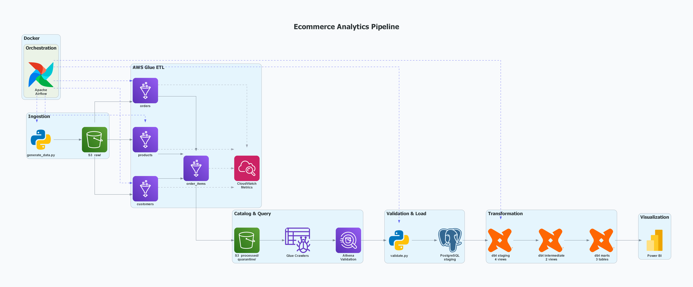
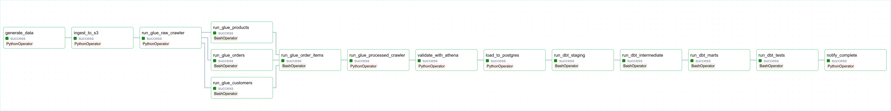

# ecommerce-analytics

[](https://github.com/kunchalathejakumar/ecommerce-analytics/actions/workflows/dbt_ci.yml)

End-to-end ecommerce analytics pipeline built on AWS (S3, Glue, Athena), dbt, PostgreSQL, and Apache Airflow.
Covers every stage from synthetic data generation through cloud ETL, multi-layer SQL transformation, and Power BI reporting.
Apache Airflow runs inside Docker and orchestrates the full pipeline — from `generate_data.py` through dbt mart builds.

## Architecture Overview



## Tech Stack

| Layer | Tool | Version / Notes |
|---|---|---|
| Data Generation | Python + Faker | Python 3.13, configurable volumes & issue injection |
| Cloud Storage | AWS S3 | Partitioned by `load_date=YYYY-MM-DD`, Parquet (processed) |
| ETL | AWS Glue | 4 PySpark jobs, job bookmarks, quarantine pattern |
| Data Catalog | AWS Glue Crawlers | raw + processed crawlers → `ecommerce_catalog` Athena DB |
| Query Layer | AWS Athena | Post-ETL validation, staging load source |
| Data Quality | Athena validation script + dbt tests | 5 Athena checks, not_null / unique / accepted_values / expression_is_true |
| Transformation | dbt-postgres | 1.10.0 with dbt_utils 1.1.1 |
| Orchestration | Apache Airflow | 2.8.0-python3.11 (Docker), 15-task DAG |
| Visualization | Power BI | 5 report pages: Executive Summary, Sales Trends, Product Performance, Customer Insights, Pipeline Health |
| CI/CD | GitHub Actions | PostgreSQL 15 service container, inline seed data, PR comment upsert |

## Project Structure

```
ecommerce-analytics/
├── .github/
│   └── workflows/
│       └── dbt_ci.yml              # CI pipeline: build + test dbt on every PR to main
├── dbt_project/
│   ├── dbt_project.yml             # Project config: name=ecommerce, model paths, materializations
│   ├── profiles.yml                # Connection config driven entirely by env vars
│   ├── packages.yml                # dbt_utils 1.1.1
│   ├── macros/
│   │   ├── generate_schema_name.sql  # Override: models land in staging/intermediate/marts (no target prefix)
│   │   └── tests/
│   │       └── expression_is_true.sql  # Custom generic test used in mart_sales_daily
│   └── models/
│       ├── staging/                # 4 views — clean, typed, renamed source columns
│       │   ├── schema.yml          # Source definitions + model tests (PK, FK, not_null, accepted_values)
│       │   ├── stg_customers.sql
│       │   ├── stg_orders.sql
│       │   ├── stg_products.sql
│       │   └── stg_order_items.sql
│       ├── intermediate/           # 2 views — business logic: flags, tiers, time dims, joins
│       │   ├── schema.yml
│       │   ├── int_orders.sql
│       │   └── int_order_items.sql
│       └── marts/                  # 3 tables with indexes — analytics-ready aggregates
│           ├── schema.yml
│           ├── mart_sales_daily.sql
│           ├── mart_customer_summary.sql
│           └── mart_product_performance.sql
├── glue_scripts/
│   ├── customers_transform.py      # Glue PySpark: dedupe, normalise, email regex, CloudWatch metrics
│   ├── products_transform.py       # Glue PySpark: category typo fix, cost imputation, price validation
│   ├── orders_transform.py         # Glue PySpark: multi-format date parse, FK validation vs customers
│   └── order_items_transform.py    # Glue PySpark: FK validation vs orders + products, revenue calc
├── ingestion/
│   ├── generate_data.py            # Synthetic CSV generation: 4 entities, configurable --run-id / --id-base
│   ├── upload_to_s3.py             # Partitioned S3 upload with manifest and skip-if-exists
│   ├── run_glue_crawler.py         # Poll loop for Glue crawler state (READY / FAILED / RUNNING)
│   ├── athena_validation.py        # 5-check Athena validation with --max-quarantine-rate threshold
│   └── athena_to_postgres.py       # Athena → PostgreSQL: truncate+append, FK indexes, VACUUM ANALYZE
├── docker/
│   ├── docker-compose.yml          # Services: postgres:5433, airflow-webserver:8080, airflow-scheduler
│   ├── postgres-init/
│   │   └── 01_create_airflow_db.sql  # Bootstrap Airflow metadata DB on first start
│   └── airflow/
│       ├── Dockerfile              # apache/airflow:2.8.0-python3.11 + AWS CLI v2 bundle
│       ├── requirements.txt        # boto3, pandas, psycopg2, dbt-postgres, sqlalchemy, etc.
│       ├── dbt_profiles.yml        # dbt profiles for Airflow container (env-var driven)
│       └── dags/
│           └── ecommerce_pipeline.py  # 15-task DAG: full pipeline from generate_data → notify_complete
├── docs/
│   └── screenshots/
│       ├── powerbi/
│       │   ├── Executive Summary.png
│       │   ├── Sales Trends.png
│       │   ├── Product Performance.png
│       │   ├── Customer Insights.png
│       │   └── Pipeline Health.png
│       └── airflow/
│           └── Airflow_DAG.png     # DAG graph export
├── .env.example                    # All required env vars with placeholder values
├── Makefile                        # make up / down / logs / ps / clean
└── requirements.txt                # Full local dev dependency freeze (Python 3.13)
```

## Docker Setup

Airflow (webserver + scheduler) and PostgreSQL run entirely inside Docker. No local Airflow or Postgres install is required.

### Services

| Service | Image | Port | Role |
|---|---|---|---|
| `postgres` | `postgres:15` | `5433` (host) / `5432` (internal) | Airflow metadata DB + analytics staging/marts schemas |
| `airflow-init` | custom `Dockerfile` | — | One-shot: initialises Airflow DB and creates the default admin user |
| `airflow-webserver` | custom `Dockerfile` | `8080` | Airflow UI |
| `airflow-scheduler` | custom `Dockerfile` | — | DAG scheduling and task execution |

### Custom Airflow Image (`docker/airflow/Dockerfile`)

Base: `apache/airflow:2.8.0-python3.11`

Additional layers:
- **AWS CLI v2** — installed from the official binary bundle (`awscli-exe-linux-x86_64.zip`) so it does not conflict with Airflow's `boto3`/`botocore` pins.
- **Python packages** — `boto3`, `pandas`, `psycopg2-binary`, `dbt-postgres`, `sqlalchemy`, and others from `docker/airflow/requirements.txt`.
- **dbt profiles** — `docker/airflow/dbt_profiles.yml` is copied into the container; all connection values are injected via environment variables at runtime.

### Volume Mounts

| Host path | Container path | Purpose |
|---|---|---|
| `./docker/airflow/dags` | `/opt/airflow/dags` | DAG files |
| `./docker/airflow/dbt_profiles.yml` | `/home/airflow/.dbt/profiles.yml` | dbt connection config |
| `./dbt_project` | `/opt/airflow/dbt_project` | dbt models, macros, tests |
| `./ingestion` | `/opt/airflow/ingestion` | Python ingestion scripts |
| `./.env` | env_file | All secrets and configuration |

### Starting the Stack

```bash
cp .env.example .env   # fill in all values
make up                # docker compose up -d --build
```

Airflow UI is available at `http://localhost:8080` (default credentials: `admin` / `admin`).
PostgreSQL is reachable at `localhost:5433` from the host and at `postgres:5432` from inside the Docker network.

---

## Pipeline Deep-Dive

### Data Generation

`ingestion/generate_data.py` produces four CSV files under `data/generated/`:
`customers`, `products`, `orders`, and `order_items`.

Key parameters:
- **`--run-id` / `--id-base`** — each run gets a non-overlapping surrogate key range via `ID_RUN_STRIDE = 25,000,000`, preventing primary key collisions when datasets are appended across runs.
- **Issue injection** — 0–5 % of rows receive deliberately malformed values (invalid emails, null IDs, negative prices, future-dated orders) to exercise the Glue quarantine logic.
- **Volumes** — configurable via `--output-dir`; the DAG passes optional Airflow Variable overrides at runtime.
- **Product catalog** — 8 categories (Electronics, Clothing, Home & Kitchen, etc.); **customer segments** — 6 tiers (VIP, Loyal, Regular, New, At-Risk, Bargain Hunter).

### S3 Ingestion

`ingestion/upload_to_s3.py` uploads each CSV into a Hive-style partition:

```
s3://{bucket}/raw/{table}_raw/load_date=YYYY-MM-DD/{filename}.csv
```

Additional behaviour:
- Skips files that already exist at the target key (idempotent re-runs).
- Writes a JSON manifest to `s3://{bucket}/logs/ingestion/{date}_manifest.json` with per-file row counts and sizes.
- Retry logic with exponential backoff (up to 3 attempts per file).

### AWS Glue ETL

Four PySpark jobs — one per entity — share a common pattern:

1. Read source CSV from S3 with **job bookmarks** enabled (incremental processing).
2. Apply entity-specific transformations (deduplication, type casting, normalisation).
3. Split output into a **clean** branch and a **quarantine** branch; quarantine rows carry a `failure_reason` column.
4. Write both branches as **Parquet with Snappy compression** to `s3://{bucket}/processed/` and `s3://{bucket}/quarantine/` respectively.
5. Publish **CloudWatch metrics** to the `EcommerceAnalytics/{Entity}ETL` namespace: `InputCount`, `CleanCount`, `QuarantineCount`, `QuarantineRate`.

Entity-specific logic highlights:

| Job | Key transformations | Quarantine reasons |
|---|---|---|
| `customers_transform` | Title-case names, country standardisation (US/UK variants), segment imputation | `invalid_email_format`, `missing_or_invalid_customer_id`, `missing_name` |
| `products_transform` | Category typo fix (`electornics` → `Electronics`), cost imputation via `percentile_approx` | `missing_or_invalid_product_id`, `invalid_cost_price`, `invalid_list_price`, `price_below_cost_price` |
| `orders_transform` | Multi-format date parse (`yyyy-MM-dd`, `dd/MM/yyyy`, `MMM dd yyyy`), status normalisation, FK join vs processed customers | Invalid customer FK, unparseable dates |
| `order_items_transform` | FK validation vs processed orders + products, quantity/price positivity filter, revenue calculation | Invalid order/product FK, non-positive quantity or unit price |

### Glue Crawlers

`ingestion/run_glue_crawler.py` starts the named crawler and polls every 15 seconds.
Terminal states: `READY` (success or warnings) and `FAILED` (raises exception). The script logs the CloudWatch log group and stream URL when available.

Two crawlers run in sequence within the DAG:
1. **`ecommerce-raw-crawler`** — runs after S3 upload to register the raw partition schema.
2. **`ecommerce-processed-crawler`** — runs after all four Glue ETL jobs to register the processed + quarantine schemas in `ecommerce_catalog`.

### Athena Validation

`ingestion/athena_validation.py` executes five checks against the `ecommerce_catalog` Athena database:

| # | Check | Failure condition |
|---|---|---|
| 1 | Row count comparison | Quarantine rate exceeds `--max-quarantine-rate` (default 5 %) |
| 2 | Null scan | NULL counts per column in the `orders` table |
| 3 | Status distribution | `GROUP BY status` — surfaces unexpected status values |
| 4 | Date range | `MIN`/`MAX` of `order_date`; fails if future-dated rows exist |
| 5 | Quarantine breakdown | `GROUP BY failure_reason` — shows which rule triggered each quarantine |

Configurable via `--entities` (default: all four) and `--max-quarantine-rate`. The Airflow DAG passes the rate from an optional Airflow Variable at runtime.

### Staging Load

`ingestion/athena_to_postgres.py` reads each processed table from Athena via paginated result fetching (page size 1000, 900 s timeout) and writes it to the PostgreSQL `staging` schema.

Load pattern per table:
1. `TRUNCATE staging.{table}` — clears existing data while preserving dependent dbt views.
2. `DataFrame.to_sql(..., if_exists='append', chunksize=500, method='multi')` via SQLAlchemy.
3. Post-load FK index creation:
   - `idx_orders_customer_id ON staging.orders(customer_id)`
   - `idx_order_items_order_id ON staging.order_items(order_id)`
   - `idx_order_items_product_id ON staging.order_items(product_id)`
4. `VACUUM ANALYZE staging.{table}` — updates planner statistics.

### dbt Transformation

Three materialisation layers built in sequence by the DAG:

```
staging (4 views) → intermediate (2 views) → marts (3 tables)
```

**Key business logic:**

| Logic | Location | Definition |
|---|---|---|
| `margin` / `margin_pct` | `stg_products` | `list_price - cost_price`; `(margin / cost_price) * 100` rounded to 2 dp |
| `line_revenue` | `stg_order_items` | `quantity * unit_price * (1 - coalesce(discount, 0))` |
| `is_failed_order` | `int_orders` | `TRUE` when `status IN ('cancelled', 'returned')` |
| `order_value_tier` | `int_orders` | `high` > $1,000 / `medium` > $500 / `low` ≤ $500 |
| `line_cost` / `line_profit` | `int_order_items` | `quantity * product_cost_price`; `line_revenue - line_cost` |
| `customer_value_tier` | `mart_customer_summary` | `vip` > $10K / `high` > $5K / `medium` > $1K / `low` ≤ $1K |
| `revenue_rank` / `profit_rank` | `mart_product_performance` | `rank()` window functions over all products |

### Airflow Orchestration

DAG ID: `ecommerce_daily_pipeline` — `schedule_interval=None` (manual trigger only).
Default retries: 2, retry delay: 5 minutes.

Full task dependency chain (copied verbatim from `docker/airflow/dags/ecommerce_pipeline.py`):

```python
generate_data >> ingest_to_s3
ingest_to_s3 >> run_glue_raw_crawler
run_glue_raw_crawler >> [run_glue_customers, run_glue_products, run_glue_orders]
[run_glue_customers, run_glue_products, run_glue_orders] >> run_glue_order_items
run_glue_order_items >> run_glue_processed_crawler
run_glue_processed_crawler >> validate_with_athena
validate_with_athena >> load_to_postgres
load_to_postgres >> run_dbt_staging
run_dbt_staging >> run_dbt_intermediate >> run_dbt_marts >> run_dbt_tests >> notify_complete
```

Optional runtime overrides via Airflow Variables:

| Variable | Effect |
|---|---|
| `ecommerce_pipeline_generate_data_output_dir` | Override `--output-dir` for generate_data |
| `ecommerce_pipeline_generate_data_run_id` | Set `--run-id` for non-overlapping surrogate keys |
| `ecommerce_pipeline_athena_validation_max_quarantine_rate` | Override the 5 % quarantine threshold |

## dbt Models Reference

### Staging (views — schema: `staging`)

| Model | Materialisation | Key columns | Tests |
|---|---|---|---|
| `stg_customers` | view | `customer_id`, `name` (initcap), `email` (lower), `segment` (lower), `country` (upper), `loaded_at` | PK `customer_id`, unique `email`, not_null all, accepted_values `segment` |
| `stg_orders` | view | `order_id`, `customer_id`, `order_date`, `status`, `total_amount`, `shipping_region`, `loaded_at` | PK `order_id`, FK → `stg_customers`, not_null core fields, accepted_values `status` (completed, shipped, cancelled, returned) |
| `stg_products` | view | `product_id`, `product_name` (initcap), `category` (lower), `price`, `cost_price`, `margin`, `margin_pct`, `loaded_at` | PK `product_id`, not_null numeric fields; row filter: `cost_price > 0` AND `list_price >= cost_price` |
| `stg_order_items` | view | `order_id`, `item_id`, `product_id`, `quantity`, `unit_price`, `discount`, `line_revenue`, `loaded_at` | FK → `stg_orders` + `stg_products`, not_null all; row filter: `quantity > 0` AND `unit_price > 0` |

### Intermediate (views — schema: `intermediate`)

| Model | Materialisation | Key columns | Tests |
|---|---|---|---|
| `int_orders` | view | `order_id`, `customer_id`, `order_date`, `status`, `total_amount`, `shipping_region`, `is_failed_order`, `order_value_tier`, `order_year/month/quarter/day_of_week/year_month/day_name`, customer denorm columns, `loaded_at` | PK `order_id`, FK → `stg_customers`, not_null, accepted_values `order_value_tier` (high, medium, low) |
| `int_order_items` | view | `order_id`, `item_id`, `product_id`, `quantity`, `unit_price`, `line_revenue`, `product_category`, `product_cost_price`, `product_price`, `product_margin`, `product_margin_pct`, `line_cost`, `line_margin_pct` | FK → `int_orders` + `stg_products`, not_null all |

### Marts (tables with indexes — schema: `marts`)

| Model | Materialisation | Key columns | Tests |
|---|---|---|---|
| `mart_sales_daily` | table | `order_date`, time dimensions, `shipping_region`, `customer_segment`, `order_count`, `unique_customers`, `total_revenue`, avg/min/max/median order value, `high/medium/low_value_orders`, `updated_at` | not_null `order_date`, `order_count`, `total_revenue`; expression_is_true `total_revenue >= 0` |
| `mart_customer_summary` | table | `customer_id`, customer attributes, `total_orders`, `lifetime_value`, `avg_order_value`, `max_order_value`, `unique_products_purchased`, `total_items_purchased`, `total_profit`, `avg_profit_per_item`, `first/last_order_date`, `customer_lifespan_days`, `days_since_last_order`, `customer_value_tier`, `dbt_updated_at` | PK `customer_id`, not_null `lifetime_value`, `total_orders` |
| `mart_product_performance` | table | `product_id`, product attributes, `orders_with_product`, `total_quantity_sold`, `total_revenue`, `total_cost`, `total_profit`, `avg_margin_pct`, `avg_discount_rate`, `discount_rate_pct`, segment qty breakdowns, `revenue_rank`, `profit_rank`, `dbt_updated_at` | PK `product_id`, not_null `total_revenue`, `total_profit` |

## Data Quality

### Quarantine Pattern

Each Glue ETL job performs validation inline and routes failing rows to a dedicated S3 path:

```
s3://{bucket}/quarantine/{entity}/{load_date}/
```

Quarantined rows include a `failure_reason` column (e.g. `invalid_email_format`, `price_below_cost_price`) to enable downstream root-cause analysis. Clean rows proceed to `s3://{bucket}/processed/{entity}/{load_date}/`. Both paths are catalogued by the processed Glue crawler and queryable in Athena.

### Athena Validation

After both crawlers complete, `athena_validation.py` runs five checks (described in the Pipeline Deep-Dive above). The `--max-quarantine-rate` threshold (default 5 %) causes a hard failure that blocks the `load_to_postgres` task, preventing dirty data from entering the serving layer.

### dbt Test Suite

Every model has tests defined in the corresponding `schema.yml`. Test types used:

| Test type | Source | Where applied |
|---|---|---|
| `not_null` | dbt built-in | All PK, FK, and key metric columns |
| `unique` | dbt built-in | PK columns (`customer_id`, `order_id`, `product_id`, `item_id`, `email`) |
| `relationships` | dbt built-in | All FK columns across staging and intermediate |
| `accepted_values` | dbt built-in | `status` (staging), `order_value_tier` (intermediate), `segment` (staging) |
| `expression_is_true` | custom macro | `total_revenue >= 0` in `mart_sales_daily` |

The CI badge reflects the result of `dbt test --store-failures` on every PR to `main`. Any test failure turns the badge red and blocks the merge.

## CI/CD

### GitHub Actions (`dbt_ci.yml`)

Trigger: every pull request targeting `main`.

| Step | Action |
|---|---|
| 1 | Checkout repository |
| 2 | Set up Python 3.13 |
| 3 | Cache pip (keyed on `requirements.txt` hash) |
| 4 | `pip install dbt-postgres==1.10.0 psycopg2-binary==2.9.11` |
| 5 | `dbt deps` — install dbt_utils 1.1.1 |
| 6 | `psql` — create schemas (`staging`, `intermediate`, `marts`, `dbt_test__audit`) and source DDL matching `staging/schema.yml` |
| 7 | Inline Python seed — insert 50 customers · 30 products · 60 orders · 120 order_items |
| 8 | `dbt debug` — verify connection to service container |
| 9 | `dbt run` — build all three model layers |
| 10 | `dbt test --store-failures` (`continue-on-error: true` so the comment step always runs) |
| 11 | Parse `target/run_results.json` → markdown table (passed / failed / warned / errored counts) |
| 12 | Post or **upsert** a PR comment with the test-results table (finds existing bot comment by `"dbt Test Results"` marker) |
| 13 | Fail the job explicitly if step 10 had failures |

**Why inline seed data instead of CSV files?** The `data/` directory is gitignored (it holds large generated datasets). Rather than committing a separate `seeds/` directory, step 7 generates a minimal, self-consistent fixture set in Python that satisfies all FK constraints and `accepted_values` tests defined in `staging/schema.yml`.

**PostgreSQL service container** runs `postgres:15`, listens on port 5432 (not the default 5433 used locally), and receives the same credentials from GitHub Secrets. `profiles.yml` is overridden via `POSTGRES_PORT=5432` in the job env.

### Required Secrets

| Secret | Required | Description |
|---|---|---|
| `POSTGRES_HOST` | Yes | Hostname for the service container (`localhost`) |
| `POSTGRES_USER` | Yes | PostgreSQL username (e.g. `admin`) |
| `POSTGRES_PASSWORD` | Yes | PostgreSQL password |

Set at **Settings → Secrets and variables → Actions → New repository secret**.

## Local Development

### Prerequisites

- Docker Desktop (for `make up`)
- Python 3.13
- `dbt-postgres==1.10.0` (or install from `requirements.txt`)
- AWS CLI v2 (for running ingestion scripts outside Docker)

### Setup

```bash
# 1. Clone and configure
git clone https://github.com/kunchalathejakumar/ecommerce-analytics.git
cd ecommerce-analytics
cp .env.example .env          # fill in all values before proceeding

# 2. Start local services (PostgreSQL on :5433, Airflow on :8080)
make up

# 3. First-time Airflow initialisation
#    On the very first `make up`, the airflow-init service creates the
#    metadata database and default admin user. Wait ~60 s before using the UI.

# 4. dbt setup and validation
cd dbt_project
dbt deps                       # install dbt_utils
dbt debug                      # verify PostgreSQL connection
dbt run                        # build staging → intermediate → marts
dbt test                       # run all schema + data tests
cd ..
```

### Triggering the DAG Manually

1. Open Airflow at `http://localhost:8080`.
2. Navigate to **DAGs → ecommerce_daily_pipeline**.
3. Click the **Trigger DAG** button (play icon).
4. Optionally set Variables under **Admin → Variables** before triggering:

| Variable | Example value | Effect |
|---|---|---|
| `ecommerce_pipeline_generate_data_output_dir` | `data/generated` | Output path for CSVs |
| `ecommerce_pipeline_generate_data_run_id` | `2` | Non-overlapping ID range for run 2 |
| `ecommerce_pipeline_athena_validation_max_quarantine_rate` | `0.03` | Stricter 3 % quarantine threshold |

### AWS Prerequisites (checklist)

Before running the full pipeline end-to-end, provision the following AWS resources:

- [ ] S3 bucket matching `S3_BUCKET` in `.env`
- [ ] Athena output prefix matching `ATHENA_OUTPUT_S3` in `.env`
- [ ] Glue job: `ecommerce-customers-transform`
- [ ] Glue job: `ecommerce-products-transform`
- [ ] Glue job: `ecommerce-orders-transform`
- [ ] Glue job: `ecommerce-order-items-transform`
- [ ] Glue crawler: `ecommerce-raw-crawler`
- [ ] Glue crawler: `ecommerce-processed-crawler`
- [ ] Athena database: `ecommerce_catalog`

## Environment Variables

Full reference from `.env.example`:

| Variable | Required | Description |
|---|---|---|
| `AWS_ACCESS_KEY_ID` | Yes | IAM access key with S3, Glue, Athena, CloudWatch permissions |
| `AWS_SECRET_ACCESS_KEY` | Yes | IAM secret key |
| `AWS_REGION` | Yes | AWS region (e.g. `us-east-1`) |
| `S3_BUCKET` | Yes | S3 bucket name for raw, processed, quarantine, and logs prefixes |
| `ATHENA_OUTPUT_S3` | Yes | S3 URI for Athena query result output (e.g. `s3://bucket/athena-results/`) |
| `ATHENA_WORKGROUP` | No | Athena workgroup (defaults to `primary`) |
| `POSTGRES_HOST` | Yes | PostgreSQL host (`localhost` outside Docker; `postgres` inside Airflow network) |
| `POSTGRES_PORT` | Yes | PostgreSQL port (`5433` for local Docker; `5432` inside Docker network) |
| `POSTGRES_DB` | Yes | Database name (e.g. `ecommerce`) |
| `POSTGRES_USER` | Yes | PostgreSQL user (e.g. `admin`) |
| `POSTGRES_PASSWORD` | Yes | PostgreSQL password |
| `POSTGRES_SCHEMA_STAGING` | No | Staging schema name (default `staging`) |
| `POSTGRES_SCHEMA_MARTS` | No | Marts schema name (default `marts`) |
| `AIRFLOW_UID` | Yes | Host user UID for file permission alignment in Docker volumes (e.g. `50000`) |
| `AIRFLOW_FERNET_KEY` | Yes | Base64-encoded Fernet key for Airflow connection encryption |
| `AIRFLOW_WEBSERVER_SECRET_KEY` | Yes | Flask secret key for the Airflow webserver session |
| `GLUE_JOB_NAME_CUSTOMERS` | Yes | AWS Glue job name for the customers ETL |
| `GLUE_JOB_NAME_PRODUCTS` | Yes | AWS Glue job name for the products ETL |
| `GLUE_JOB_NAME_ORDERS` | Yes | AWS Glue job name for the orders ETL |
| `GLUE_JOB_NAME_ORDER_ITEMS` | Yes | AWS Glue job name for the order_items ETL |
| `GLUE_CRAWLER_NAME_RAW` | Yes | Name of the Glue crawler for raw S3 data |
| `GLUE_CRAWLER_NAME_PROCESSED` | Yes | Name of the Glue crawler for processed + quarantine data |

## Key Design Decisions

- **Truncate + append instead of DROP TABLE in `athena_to_postgres`** — dbt staging models are views that reference `staging.*` tables directly. Dropping a table would cascade and destroy those views. Truncating preserves the table definition and all dependent objects, so dbt can run immediately after the load without needing `dbt run --full-refresh`.

- **`generate_schema_name` macro overrides dbt default** — dbt's built-in behaviour concatenates the target schema with the custom schema (e.g. `marts_staging`). The override returns `custom_schema_name` unchanged, so models land in `staging`, `intermediate`, and `marts` exactly — matching the PostgreSQL schemas created by `docker-compose` and the CI setup step.

- **CI uses inline Python seed data instead of CSV seeds** — the `data/` directory is gitignored to keep large generated files out of the repository. Committing a `seeds/` directory would duplicate schema maintenance. The inline approach generates a minimal, FK-consistent fixture set in a single step that never drifts from the actual `schema.yml` constraints.

- **Airflow image is `apache/airflow:2.8.0-python3.11` with AWS CLI v2 bundled separately** — installing `awscli` via pip would pin `boto3`/`botocore` to versions that conflict with Airflow's own providers. The Dockerfile installs AWS CLI v2 from the official binary bundle (`awscli-exe-linux-x86_64.zip`), which ships its own bundled boto3 and does not affect the Python environment.

- **`schedule_interval=None` (manual trigger)** — this is a portfolio demonstration project. A commented-out `0 6 * * *` cron expression shows the intended production schedule, but manual triggering keeps AWS costs predictable during development and review.

## Dashboard & Pipeline Visuals

### 📊 Power BI Dashboard

| Executive Summary | Sales Trends |
|---|---|
|  |  |

*Executive Summary: top-level KPIs across revenue, orders, and customer lifetime value.*

| Product Performance | Customer Insights |
|---|---|
|  |  |

*Product Performance and Customer Insights: margin analysis by category, revenue ranking, and RFM-based customer segmentation.*


*Pipeline Health: Glue quarantine rates, CloudWatch ETL metrics, and dbt test pass rates.*

### 🔄 Airflow DAG



*15-task DAG spanning data generation, S3 ingestion, Glue ETL (4 entities), crawler orchestration, Athena validation, staging load, and the full dbt transformation layer.*

---

Built by Theja Kumar Kunchala as Project 1 of a 5-project Data Engineering Portfolio.
